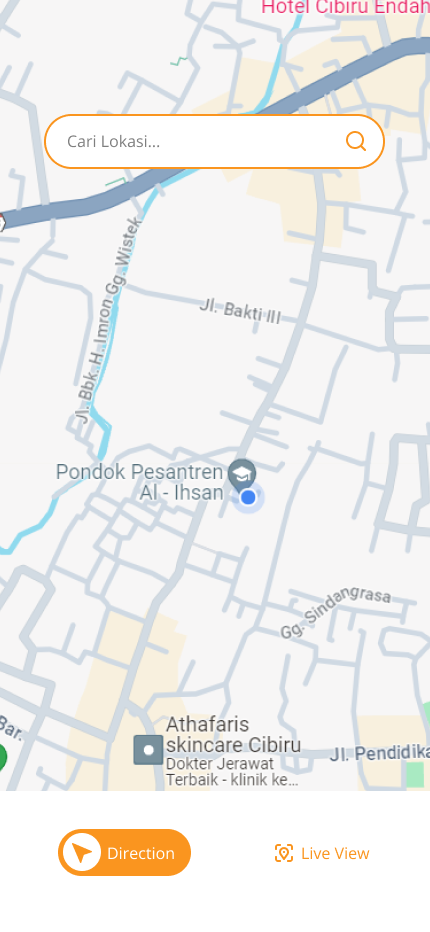
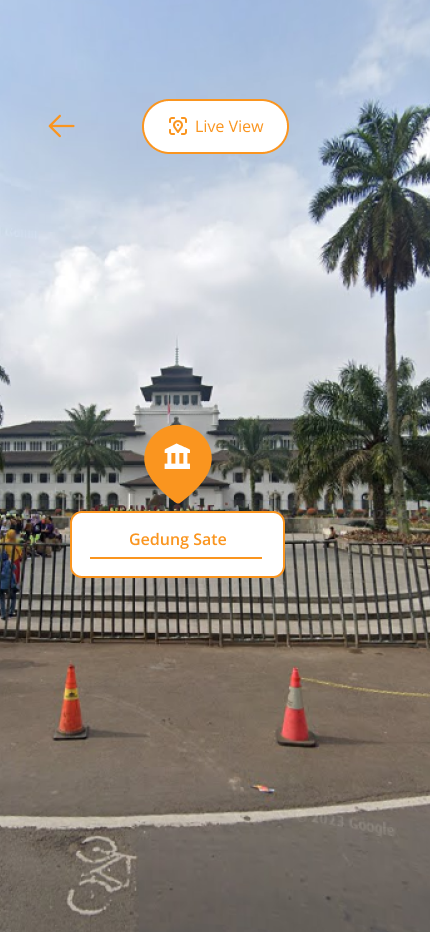

## Intro 
- Rancangan Pembuatan Aplikasi untuk Navigasi Perkotaan berbasis Augmented Reality dengan Memanfaatkan Sensor Smartphone. 

## Latar Belakang 
Pembuatan Aplikasi ini dilatarbelakangi oleh:
- **Pertumbuhan AR dan Perkembangan Teknologi**: AR adalah teknologi yang semakin berkembang dengan cepat, dengan peningkatan perangkat keras dan perangkat lunak yang semakin canggih. Ini menciptakan peluang besar dalam pengembangan sistem navigasi AR yang lebih baik.
- **Tantangan dalam Navigasi Sehari-Hari**: Orang-orang di seluruh dunia menghadapi tantangan dalam navigasi sehari-hari, baik dalam berkendara, berjalan kaki, bersepeda, atau menggunakan transportasi umum. Masalah seperti kemacetan, keselamatan, atau kesulitan menemukan lokasi yang diinginkan sering kali menjadi masalah yang harus diatasi.
- **Potensi Integrasi Informasi Kontekstual**: Teknologi AR memungkinkan integrasi informasi kontekstual, seperti data cuaca, lalu lintas, atau objek sekitar, ke dalam pengalaman navigasi. Ini menciptakan peluang untuk meningkatkan efektivitas dan relevansi panduan navigasi.
- **Peningkatan Pengalaman Wisata dan Pariwisata**: Dalam konteks pariwisata, penggunaan AR dalam navigasi dapat meningkatkan pengalaman pengunjung dengan memberikan informasi tentang objek wisata, sejarah lokal, atau rekomendasi makanan.

## Branding 
- Merk: **yuulin** 
- Inspirasi merk: Kata dari Bahasa Sunda yaitu Yu (Ayo) dan Ulin (Main) yang berarti ajakan untuk bermain.
- Tagline: Pengalaman Navigasi Berbasis Augmented Reality 
- Campaign: Meningkatkan pengalaman Eksplorasi daerah dengan Augmented Reality.
- Target user:
  - Usia 13+
  - Turis
  - Menginginkan eksplorasi daerah yang lebih menarik
  - Memiliki keingintahuan lebih untuk mengenal daerah (Pendidikan)
- User experience theme:
  - Navigasi yang intuitif / Sederhana
  - Terhubung dengan Layanan Global Positioning System (GPS)
  - Aksesibilitas yang mudah, dapat digunakan setiap kalangan
  - Adanya Interaksi atau Panduan Suara

## User Story
|Sebagai|Saya ingin bisa|Sehingga|Prioritas
|---|---|---|---|
|Sistem|Melakukan Pemindaian pada objek|Bisa memberikan Respon sesuai informasi Objek|⭐⭐⭐⭐⭐|
|Sistem AR|&raquo; Menampilkan Informasi terkait Objek |Pengguna Mendapatkan Informasi terkait objek|⭐⭐⭐⭐⭐|
|Sistem AR|&raquo; Menampilkan Petunjuk Arah 3D sesuai tujuan|Mempermudah pengguna dalam bernavigasi secara Real-Time|⭐⭐⭐|
|Sistem AR|&raquo; Memberikan petunjuk arah berdasarkan GPS|Pengguna dapat melalui arah dan mendapatkan gambaran lokasi|⭐⭐⭐⭐|
|Sistem|Memberikan Notifikasi Sampai Tujuan|Pengguna Dapat melakukan Pemindaian Lokasi|⭐⭐⭐⭐⭐|
|Sistem|Menampilkan Map berdasarkan Lokasi Terkini|Pengguna dapat melakukan Pencarian Lokasi yang dituju|⭐⭐⭐⭐⭐|

## Metode dan Algoritma 
- Sensor:
  - Lokasi
  - Kamera
  - Waktu
- Responder:
  - Smartphone
  - Spatial Map
- Mobile software development

## Struktur Data

## Arsitektur Sistem 

## Deskripsi Teknologi 
- Mesin komputasi
  - GPS API: GPS API adalah antarmuka pemrograman aplikasi yang memungkinkan pengembang untuk mengakses data lokasi dan informasi terkamelalui Global Positioning System (GPS) atau sistem penentuan lokasi lainnya. GPS adalah teknologi yang menggunakan sinyal satelit untuk menentukan posisi geografis yang akurat di permukaan bumi. API ini memungkinkan aplikasi untuk berkomunikasi dengan perangkat GPS atau sumber data lokasi lainnya dan mengintegrasikan informasi ini ke dalam aplikasi. Fungsi dari GPS ini yaitu Mendapatkan Lokasi Geografis, Pelacakan Realtime, Pencarian Lokasi, Petunjuk Arah atau Navigasi, Integrasi Peta, Geo-Fencing, Pengukuran Jarak dan Kecepatan.
  - Smartphone: Android, Android adalah sistem operasi (OS) yang dikembangkan oleh Google untuk perangkat mobile dan tablet. Android didasarkan pada kernel Linux dan menjadi salah satu sistem operasi mobile yang paling populer dan luas digunakan di seluruh dunia. 
- Software development
  - Mobile development: Java/Kotlin/C#, Pengembangan aplikasi mobile pada proses menciptakan aplikasi untuk perangkat mobile, seperti smartphone dan tablet, menggunakan bahasa pemrograman Java atau Kotlin. Java adalah salah satu bahasa pemrograman yang telah lama digunakan dalam pengembangan aplikasi mobile, terutama untuk platform Android. Sedangkan Kotlin adalah bahasa pemrograman lain yang semakin populer untuk pengembangan Android. Kotlin adalah bahasa yang sepenuhnya kompatibel dengan Java dan seringkali dianggap lebih modern dan ekspresif. C# (dibaca "C sharp") adalah bahasa pemrograman yang dikembangkan oleh Microsoft pada awal tahun 2000. Ini adalah bahasa pemrograman yang sangat populer dan digunakan secara luas untuk berbagai jenis pengembangan perangkat lunak.
  - Augmented Reality: Unity, Unity adalah lingkungan pengembangan permainan yang kuat yang juga digunakan untuk pengembangan aplikasi AR.
- Sensor 
  - Kamera: Smartphone
  - Lokasi: Smartphone
  - Waktu: Smartphone
- Responder 
  - Smartphone

## User Experience (UX) Design 

